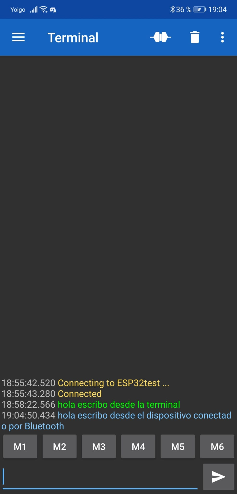
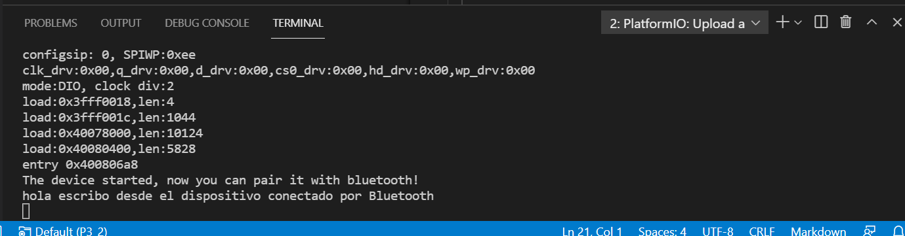

# PRACTICA 3 
### PARTE 2:
Siguiendo la programacion que se nos proporciona para realizar la practica lo primero que nos encontramos es la declaracion BluetoothSerial SerialBT el cual se utilizara para recibir cosas a traves del Bluetooth, establecer la comunicacion serial y usar funciones de este. 
Seguidamente encontramos el set up con un seguido de comandos, el primero de ellos es el serial begin a la misma velocidad del speed monitor que se encuentra en el .ini, seguido del comando serialBT.begin con un nombre cuyo comando tiene el objetivo de encender el bluetooth de la placa identificable con el nombre que se le pone a ese. Para finalizar el set up encontramos un serial print hacia la terminal/monitor que nos indica la activacion del bluetooth del dispositvo indicando que este esta listio para ser conectado.
Seguidamente nos encontramos el bloque del loop del programa este esta compuesto por un seguido de 2 if con distintas condiciones y distintos comandos en ellos, el primero if detecta si escribimos alguna entrada por teclado y la muestra en el dispositvo enlazado a este, es decir, si se cumple la condicion seria.avaliable(), es decir que se escriba por teclado en la terminal, hace el comando SerialBt.write(Serial.read());, es decir, todo lo que se intoduzca por teclado es leido y mostrado en aquel dispositivo que esta conectado en ese momento, como en la siguiente captura en verde pero tiene un inconveniente que es el siguiente lo escrito por la terminal no puede observar en esta y solo se observara en el receptor del que este emparejado en ese momento. 

Mientras que en el siguiente if es el caso contrareo es decir si se escribe algo por el terminal donde esta conectado por bluetooth ( asi cumpliendo la condicion SerialBT.available() ) y se envia a traves del comando Serial.write(SerialBT.read()); podemos capturar lo escrito en la terminal conectada y mostrarlo en la nuestra. Captura de la terminal del visual studio code: 

Captura de la terminal del dispositivo conectado, en este caso es la linia de color azul: 

